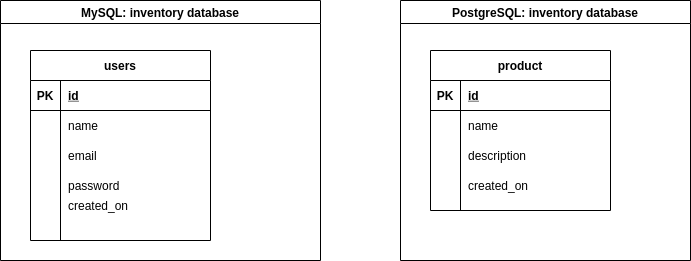
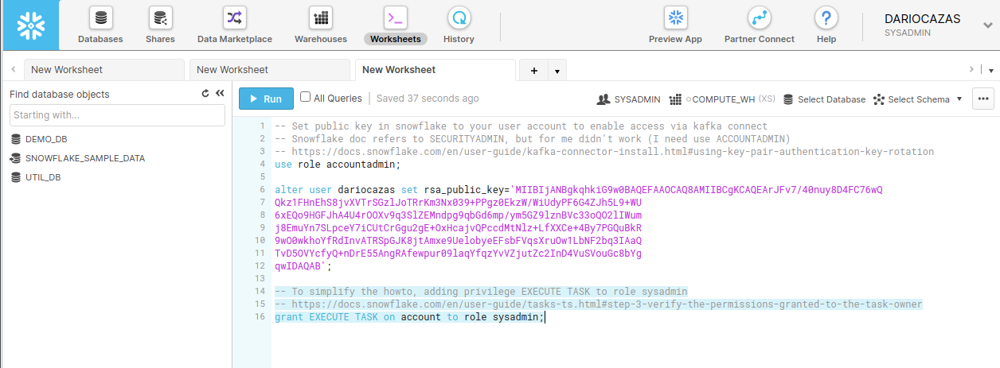

# Debezium to Snowflake

  * [Requirements](#requirements)
  * [Organization](#organization)
  * [How-to steps](#how-to-steps)
    + [Start Services](#start-services)
    + [Configure Database tables](#configure-database-tables)
    + [Start Debezium Capture](#start-debezium-capture)
    + [Create Snowflake Account](#create-snowflake-account)
    + [Start Sink Process Snowflake](#start-sink-process-snowflake)
    + [Configure Table Replication Snowflake](#configure-table-replication-snowflake)
  * [I need more!!](#i-need-more--)

This repo is a demo of how to use Debezium to capture changes over tables in MySQL and PostgreSQL 
to generate a replica in near-real-time in Snowflake. This is extensible to other databases and
describes several common points about CDC, Kafka, Kafka connect, or Snowflake tools. 

[Miguel García] and I work together on a DZone article using this repo as the demo: 
[Data Platform: Building an Enterprise CDC Solution]


In this howto, a series of services that way the solution will be deployed:

- **mysql**: database instance provided by Debezium team
- **postgres**: database instance provide by Debezium team
- **zookeeper**: as part of the Kafka ecosystem
- **kafka**: single Kafka broker
- **cdc_connect**: Kafka connect worker node, provided by Debezium team, with the connector plugins for his supported databases
- **sink_connect**: Kafka connect worker node, with the installation of Snowflake connector plugin


## Requirements

To facilitate the execution of the howto, the services will be deployed using **[docker-compose]**. 
It has a dependency of **[docker engine]**. For better compatibility, we are using the docker-compose specification 2,
so a **docker engine 1.10.0** or later should work. 

As part of the howto, you will create a Snowflake account, and the howto guide you to create a key pair for authentication.
To perform these actions, you should have an **[OpenSSL toolkit]**. Is commonly available in Linux distributions and
can be installed in Windows or Mac. If you need it, you can run it inside a docker image (will be commented in the howto).

About hardware requirements, review **[docker engine]** requirements.

## Organization

Well, this demo has several parts. To simplify this, it has been split into several folders in this repo.
For each folder you can found a README file with explanations:

- **[services]**: relative to docker images and services
- **[database]**: sentences and scripts to run inside database
- **[debezium]**: configuration and scripts to start and check the status of Debezium connectors
- **[snowflake]**: Snowflake scripts, and configuration of the Snowflake sink connector

## How-to steps


In this flow:
- Gray: local services
- Yellow: external resources

### Start Services

You need to download this repository to start the services:

```sh
# Manual download
curl https://github.com/dariocazas/howto-debezium-to-snowflake/archive/refs/heads/main.zip
# git download
git clone https://github.com/dariocazas/howto-debezium-to-snowflake.git
```

To start it, go to `services` folder and run it:

```sh
cd howto-debezium-to-snowflake/services
docker-compose up
```

All the docker-compose commands must be executed within the `services` folder since it takes certain
reference variables from the `.env` file available in that path.

Your terminal shows the log of the running services. Wait until the log stabilizes and no more traces append to the console.
You can stop this using `Ctrl+C`.

### Configure Database tables

The `database` folder contains several scripts to configure the MySQL and PostgreSQL database instance services. 
The Debezium team provides some complete example images that we are going to use to simplify the howto. 
However, you will create the tables for replication with this script:

```sh
howto-debezium-to-snowflake/database/init_db.sh
```



To see the behavior of Debezium and data replication, it is necessary to run the scripts dedicated to performing
CRUD operations during the tests, which will display the status of the affected table at the end of the screen.

```sh
howto-debezium-to-snowflake/database/mysql_crud.sh
howto-debezium-to-snowflake/database/postgres_crud.sh
```

Run these scripts as many times as you like when the solution is assembled to evaluate the behavior.

### Start Debezium Capture

The `debezium` folder contains the configuration of the Kafka connectors that runs the Debezium capture.
To start it, you need to run:

```sh
howto-debezium-to-snowflake/debezium/init_cdc.sh
```

In log console of docker services, you can see the starting traces about the process. As a check of the
process:

```sh
## Check Debezium connector status (should show RUNNING)
howto-debezium-to-snowflake/debezium/status_cdc.sh

## Goto services folder
cd howto-debezium-to-snowflake/services

## List kafka topics available (should show mysqldb.inventory.users and postgresdb.inventory.product)
docker-compose exec kafka /kafka/bin/kafka-topics.sh --bootstrap-server kafka:9092 --list

## List events captured from MySQL table (should show events related to the actual state of the database)
docker-compose exec kafka /kafka/bin/kafka-console-consumer.sh --bootstrap-server kafka:9092 \
    --from-beginning --property print.key=true --topic mysqldb.inventory.users

## List events captured from MySQL table (should show events related to the actual state of the database)
docker-compose exec kafka /kafka/bin/kafka-console-consumer.sh --bootstrap-server kafka:9092 \
    --from-beginning --property print.key=true --topic postgresdb.inventory.product
```

When you run the CRUD scripts of `database` folder, new events should be in the topics

### Create Snowflake Account

Maybe you already have a space in Snowflake, with a set of keys, and the necessary privileges. 
If so, you can move on to the next point. For those who don't, these are the steps to take at this point.

In Snowflake, you can create a free trial in https://signup.snowflake.com

For this howto, you can select a Standard Snowflake edition over any cloud. 
After validating email and access to the web console, you can see:

- The host accessed in the URL. This is needed to set your configuration for the Snowflake sink connector
- In the left panel, you can see the DEMO_DB database with a PUBLIC schema
- In the top-right panel, you can see 
  - Your role (SYSADMIN)
  - Your warehouse (COMPUTE_WH)

To configure the Snowflake Sink connector that uploads data to Snowflake, you need a key pair. 
This repo contains a key pair in `snowflake/keys` folder. You can use it or review the [snowflake/keys README]
to generate your keys. The private key is used in the configuration of the sink connector, and 
the public key is set to your Snowflake user vía SQL command.

Go to [snowflake/sql/00-security.sql] and take this code to your Worksheet. 
If you generate your key pair, replace the `rsa_public_key` for your own `.pub` key. 
To simplify the exercise, `execute task` privileges will also be granted to the `SYSADMIN` role, 
which will be the role with which you execute all our sentences. Run all queries to apply.



### Start Sink Process Snowflake


The `snowflake` folder contains the configuration of the Kafka connectors that runs the Debezium capture.
To start it, you need to review the [snowflake/connect/snowflake-sink-connector.json]:
- `snowflake.url.name`: you must use the hostname visible in the URL when you access your Snowflake account
- `snowflake.user.name`: your Snowflake user name
- `snowflake.private.key`: if you generate your key pair, replace it with the content of your `.pem` 
    file without enters, header, and footer

Next, you should run this script:
```sh
howto-debezium-to-snowflake/snowflake/init_sink.sh
```

In the docker services log console, you can see the starting traces about the process. As a check of the
process, you can query the new tables in Snowflake. They can take up to several minutes to be accessible
and to see it in the left panel you need to force a refresh.

```sql
select * from "DEMO_DB"."PUBLIC"."CDC_MYSQL_INVENTORY_USERS";
select * from "DEMO_DB"."PUBLIC"."CDC_POSTGRESDB_INVENTORY_PRODUCT";
```

With this step, you have the change events of the source database tables in the Snowflake! Use it to 
analyze the historical evolution of the table :smile:

### Configure Table Replication Snowflake

The last target of this howto: enable a table replica in Snowflake to use it like in your source database.
To enable it, take the SQL scripts:
- [snowflake/sql/01-cdc-to-replica-mysql.sql] enable replica of `users` MySQL table, and you can query
    it over the `DEMO_DB.PUBLIC.MYSQL_INVENTORY_USERS` view.
- [snowflake/sql/01-cdc-to-replica-postgres.sql] enable replica of `product` PostgreSQL table, and you 
    can query it over the `DEMO_DB.PUBLIC.POSTGRESDB_INVENTORY_PRODUCT` view.

## I need more!!

Well, check the README available in each folder. It includes some detail about his components
and some additional scripts or functions that you can use to explore this solution.

I hope this tutorial has been helpful for you and you have enjoyed it.


[Miguel García]: https://dzone.com/users/4531976/miguelglor.html
[Data Platform: Building an Enterprise CDC Solution]: https://dzone.com/articles/data-platform-building-an-enterprise-cdc-solution
[docker-compose]: https://docs.docker.com/compose/install/
[docker engine]: https://docs.docker.com/engine/
[OpenSSL toolkit]: https://github.com/openssl/openssl#build-and-install
[services]: services/README.md
[database]: database/README.md
[debezium]: debezium/README.md
[snowflake]: snowflake/README.md
[snowflake/keys README]: snowflake/keys
[snowflake/sql/00-security.sql]: snowflake/sql/00-security.sql
[snowflake/connect/snowflake-sink-connector.json]: snowflake/connect/snowflake-sink-connector.json
[snowflake/sql/01-cdc-to-replica-mysql.sql]: snowflake/sql/01-cdc-to-replica-mysql.sql
[snowflake/sql/01-cdc-to-replica-postgres.sql]: snowflake/sql/01-cdc-to-replica-postgres.sql
