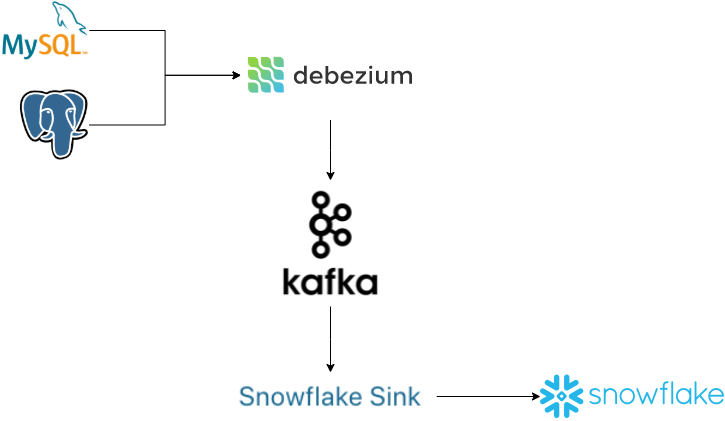
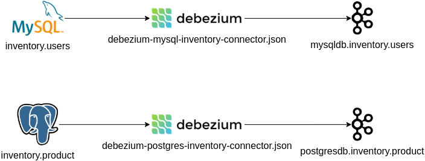
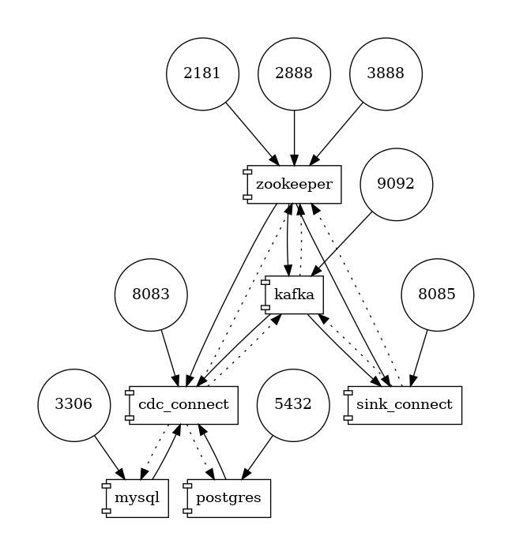

# Introduction

This article is a follow-up to the [Data Platform: Building an Enterprise CDC Solution](https://dzone.com/articles/data-platform-building-an-enterprise-cdc-solution), where [Miguel García](https://dzone.com/users/4531976/miguelglor.html) and I described:

* Several CDC (Change Data Capture) use cases and common scenarios in an enterprise platform
* A proposal using Debezium (as log-based CDC) to capture data from the relational databases, and Kafka like a channel that enables several consumers to propagate data changes for different use cases.

One of the common scenarios for this solution consists of data replication from OLTP Database to OLAP Database (from the operational database to the data warehouse).

In this article, I'm going to provide a "how-to" to deploy a sample of a CDC process to replicate data from two different relational databases to Snowflake:
* Manage the data changes in a common format.
* Setting up a Debezium in Kafka Connect to get data changes and push into Kafka topics.
* Setting up Snowflake Sink in Kafka Connect to get data changes from Kafka topics and push the data to Snowflake.
* Apply a specific replication logic to consolidate the data changes events in Snowflake, avoiding the use of the JDBC connector for better cost-effectiveness.



# Step-by-step

In the GitHub repository, we have a detailed description as well as several scripts that you will need in this "how-to":

```sh
git clone https://github.com/dariocazas/howto-debezium-to-snowflake.git
```

> Note: every folder in this repository has a README file with more info about the process.

The follow steps are:

1. Pre-requirements
   1. Local environment
   2. Snowflake database
   3. Snowflake authentication
2. How to capture data changes from databases to a Kafka topic
   1. Start local services
   2. Prepare databases
   3. Start Debezium
   4. Check data capture
3. How to push data changes from Kafka topic into Snowflake
   1. Start local sink process
   2. Check data capture into CDC tables
   3. Apply replication logic
   4. Check data replication


## 1. Pre-requirements

### 1.1. Local environment 
- [docker-compose](https://docs.docker.com/compose/install/) and [docker engine](https://docs.docker.com/engine/) 1.10.0 or later should work.
- [jq](https://stedolan.github.io/jq/download/) as a JSON parser used in scripts

### 1.2. Snowflake database

You need a Snowflake Account. You can create a trial follow the [Snowflake Trial Accounts doc](https://docs.snowflake.com/en/user-guide/admin-trial-account.html))

Access to your Snowflake Account and create a database over you run the next steps:

```sh
USE ROLE ACCOUNTADMIN;
CREATE DATABASE HOWTO_DB;
```

> Note: in a production environment, is not recommendable to use role ACCOUNTADMIN for all the tasks like I describe in this howto. 

### 1.3. Snowflake authentication

In this howto, we use a key-pair authentication. The detailed process is documented [here](https://docs.snowflake.com/en/user-guide/kafka-connector-install.html#using-key-pair-authentication-key-rotation). You can use the key-pair provided by the repository:
* Private key encrypted: `snowflake/keys/snowflake_rsa_key.p8`
* Private passphrase to decrypt: `mypassphrase`
* Public key: `snowflake/keys/snowflake_rsa_key.pub`

As the next step, in the Snowflake Worksheet, we need to register the public key (replace in this script the content of your snowflake/keys/snowflake_rsa_key.pub without header and footer)

```sql
USE ROLE ACCOUNTADMIN;
ALTER USER dariocazas SET rsa_public_key='MIIBIjANBgkqhkiG9w0BAQEFAAOCAQ8AMIIBCgKCAQEAwBwYbPtbEUXueQ6u3KDw
zlKu4IhAkGdcUBVbdTdUVBLNVsZX+eiKOedN3EnMtDeVzRlaT8JAwHX0LVXkgXtn
KzMBp6TpS4j+2kKvbZc5p0KfZHjn42G+C/DXI4ZNQZEBQ/Q4UY6OkTZepFaOX3ev
2icxB6LnnVYI3WHkSnq3vTthhYhTuUOQ4YRudadOtoT4By09hxbsaanVl42FXIZP
AXX1jwawzKe52V1+FB5/UMv+JMUFfczlO+acn/EaZvKbR55Vk/+OVrUP4KIKvdWn
s/n4ASYqxiw9xjrizGCoUyl+b+Ch6A02fTU02HrT9jOOj+dVAeFD2QGOqaze0eCD
dwIDAQAB';
```

## 2. How to capture data changes from databases to a Kafka topic

In this step, you start two different database engine and enable a CDC process. As result, you have two Kafka topics with Debezium events that you can consume.



### 2.1. Start local services

The repository contains a docker-compose to run in your local environment several services:
* Two database engines: MySQL and PostgreSQL
* One Kafka broker (and his zookeeper)
* Two Kafka connect services: one to run CDC Debezium tasks and another to send the events to Snowflake



In a terminal console run:

```sh
cd services
docker-compose up
```

It can take several minutes to download and start the services. Keep this terminal open to be able to see the log of services. In the end, you can stop all using `Ctrl+C`. 

### 2.2. Prepare databases

I provide SQL initialization scripts:
* `database/sql/00_mysql_init.sql`: create table `users`
* `database/sql/00_postgres_init.sql`: create table `product`

Init these tables over the dockerized services:

```sh
cd database
# create tables
./init_db.sh
# Populate data
./mysql_crud.sh
./postgres_crud.sh
```

As output, you can see several CRUD operations over the tables, and the last state after operations. You can close this terminal.

### 2.3. Start Debezium

The docker service `cdc_connect` has the necessary dependencies to run Debezium over MySQL and Postgres. The configuration is available in:
* `debezium/connect/debezium-mysql-inventory-connector.json`
* `debezium/connect/debezium-postgres-inventory-connector.json`

Open a terminal console and init the capture of the tables:
```sh
cd debezium
./init_cdc.sh
```

In docker-compose terminal, you can see how the connectors start. When the log stabilizes, you can check the status of the Debezium connectors in the previous terminal using:
```sh
# I asume you are in debezium folder
./status_cdc.sh
```

You can close this terminal.

### 2.4. Check data capture

You can test if the capture is working with this strategy:
* Open a terminal with live consumer events
* Do CRUD operations over the database

First for MySQL, open a terminal and run:
```sh
cd services
docker-compose exec kafka /kafka/bin/kafka-console-consumer.sh \
    --bootstrap-server kafka:9092 --from-beginning \
    --topic mysqldb.inventory.users \
    --property print.key=true --property print.timestamp=true
``` 

The terminal will populate every new event pushed from Debezium to Kafka, sending every insert/update/delete over `inventory.users` in MySQL

Open now a terminal for the same in PostgreSQL:
```sh
cd services
docker-compose exec kafka /kafka/bin/kafka-console-consumer.sh \
    --bootstrap-server kafka:9092 --from-beginning \
    --topic postgresdb.inventory.product \
    --property print.key=true --property print.timestamp=true
```

To generate new events, open a terminal and run:
```sh
cd database
./mysql_crud.sh
./postgres_crud.sh
```

You should see new data change events in the consumer terminals.

## 3. How to push data changes from Kafka topic into Snowflake

In this step, you send the Kafka events to Snowflake and generate a replica of the source tables.


### 3.1. Start local sink process

The docker service `sink_connect` has the necessary dependencies to run the Snowflake Sink connector to push new Kafka events into the Snowflake table. The configuration is available in `snowflake/connect/snowflake-sink-connector.json` and you need an update:
* The Snowflake URL with yours in field `snowflake.url.name`
* The authentication fields if you generate your key-pair in the previous step: `snowflake.private.key` and `snowflake.private.key.passphrase`

Open a terminal console and init the upload of the Kafka topics:
```sh
cd snowflake
./init_sink.sh
```

In docker-compose terminal, you can see how the connector starts. When the log stabilizes, you can check the status of the Snowflake connector in the previous terminal using:
```sh
# I asume you are in snowflake folder
./status_sink.sh
```

### 3.2. Check data capture into CDC tables

When the sink connector uploads the events from the Kafka topics, create these tables:
* `CDC_MYSQL_INVENTORY_USERS`
* `CDC_POSTGRESDB_INVENTORY_PRODUCT`

The upload to Snowflake will be done in batches, so it may take some time to see the data available in Snowflake (in the order of 30-60 seconds).

From your Snowflake Worksheet, validate that your events are populated in the new tables:
```sql
USE ROLE ACCOUNTADMIN;
USE SCHEMA HOWTO_DB.PUBLIC;
SELECT * FROM CDC_MYSQL_INVENTORY_USERS;
SELECT * FROM CDC_POSTGRESDB_INVENTORY_PRODUCT;
```

Adding new changes in your dockerized databases produces new rows in your tables.

1. In Snowflake Worksheet:
    ```sql
    SELECT 'Events MySQL', COUNT(1) FROM CDC_MYSQL_INVENTORY_USERS
    UNION ALL
    SELECT 'Events PostgreSQL', COUNT(1) FROM CDC_POSTGRESDB_INVENTORY_PRODUCT;
    ```
2. From a terminal, apply changes in your databases:
   ```sh
   cd database
   ./mysql_crud.sh
   ./postgres_crud.sh
   ```
3. Wait until the events will be sent to Snowflake (you can see the log in docker-compose terminal)
4. Repeat the query in Snowflake Worksheet

### 3.3. Apply replication logic

In the repository I provide two scripts with the SQL logic to generate the replica of the source tables:
* `snowflake/sql/01-cdc-to-replica-mysql.sql`
* `snowflake/sql/01-cdc-to-replica-postgres.sql`

From your Snowflake Worksheet, execute these two scripts. As result, you have two views with the same structure of the source databases:
* `MYSQL_INVENTORY_USERS`
* `POSTGRESDB_INVENTORY_PRODUCT`

These scripts follow the same logic, creating a scheduled task that process the new events arrived and update the replica table


> Note: one part of these SQL scripts (the MERGE sentence) depends on the source database engine. The Debezium events have the metadata about the source engine and is used to know which is the last event for an entity. Take into account if you replicate this logic in your production systems.

### 3.4. Check data replication

The end-to-end is running now. You can check the data available in your local databases and validate against Snowaflake view:
1. In a terminal, get the actual state of MySQL users table:
   ```sh
   cd services
   echo "SELECT * FROM users ORDER BY id" | docker-compose \
      exec -T mysql \
      bash -c 'mysql -u $MYSQL_USER -p$MYSQL_PASSWORD inventory'
   ```
2. Goto Snowflake Worksheet and validate the result with:
   ```sql
   USE ROLE ACCOUNTADMIN;
   USE SCHEMA HOWTO_DB.PUBLIC;
   SELECT * FROM MYSQL_INVENTORY_USERS;
   ```
3. In a terminal, get the actual state of PostgreSQL product table
   ```sh
   # I asume you are in services folder
   echo "SELECT * FROM product ORDER BY id" |  docker-compose \
      exec -T postgres \
      env PGOPTIONS="--search_path=inventory" \
      bash -c 'psql -U $POSTGRES_USER postgres'
   ```
4. And validate in Snowflake Worksheet.
   ```sql
   USE ROLE ACCOUNTADMIN;
   USE SCHEMA HOWTO_DB.PUBLIC;
   SELECT * FROM POSTGRESDB_INVENTORY_PRODUCT;
   ```
5. Generate new insert-delete-update operations from a terminal:
   ```sh
   cd database
   ./mysql_crud.sh
   ./postgres_crud.sh
   ```
6. Wait until the events was sent to Snowflake (review docker-compose terminal log)
7. Wait until the scheduled task was triggered in Snowflake
   ```sql
   USE ROLE ACCOUNTADMIN;
   select name, state, error_code, error_message,scheduled_time, next_scheduled_time
      from table(HOWTO_DB.information_schema.task_history())
      order by scheduled_time desc;
   ```
8. Validate again the content of the tables in Snowflake

# Conclusions

**Debezium provides an easy way to capture changes from databases** and populate change events in a Kafka service, that you can use to consume for several ways. 

To populate these changes to another database you can use the simplest way, but this is not always the better option **in the context of the new generation of data warehouses**, and probably you need to **take into account another kind of strategiy closed to this service** for better performance and reduce the cost of use.

First of all, study the possibilities, and after **test it with a POC similar to this howto**, including some aspects like performance and cost review, **and proceed to do the next** (security, naming, automatization, data quality, failover, ...)
